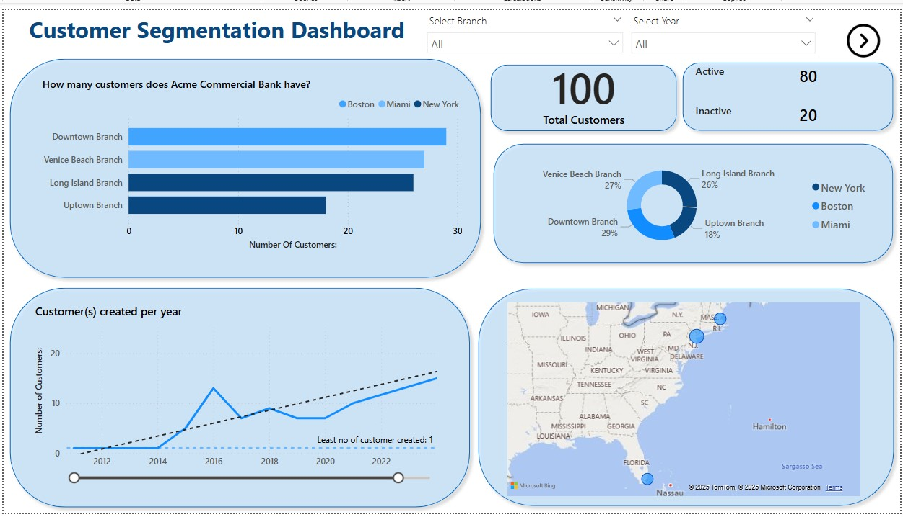
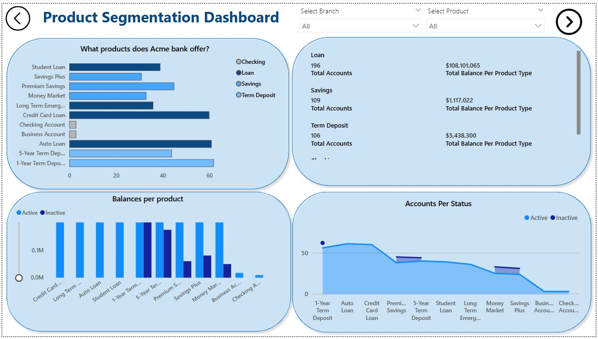
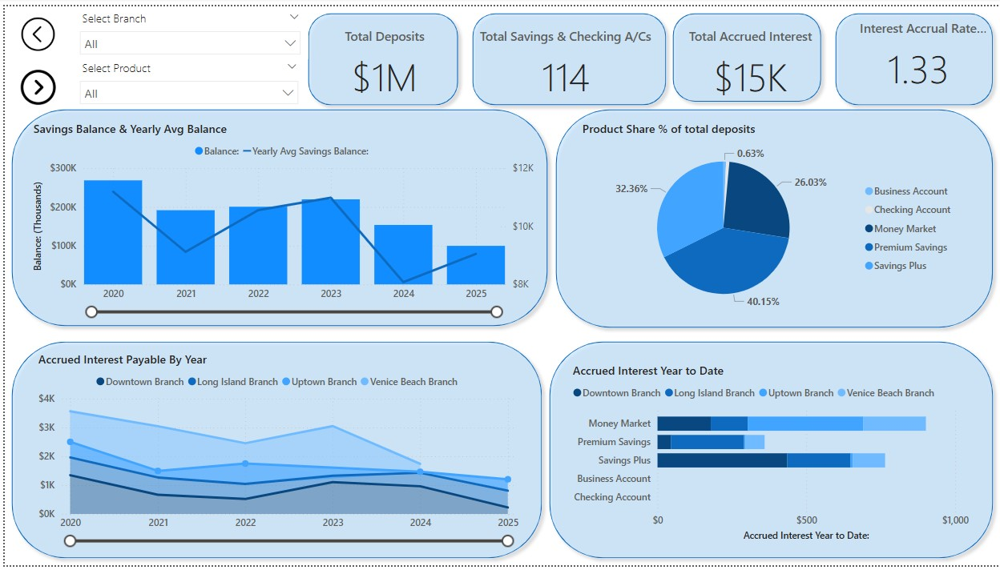
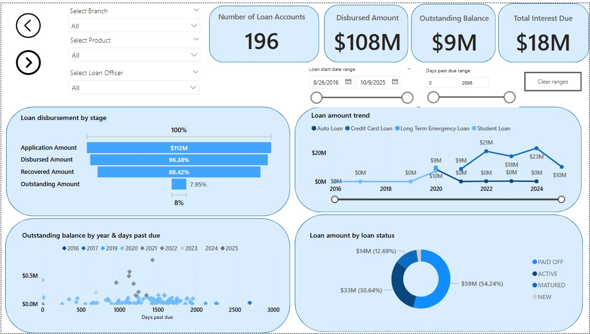
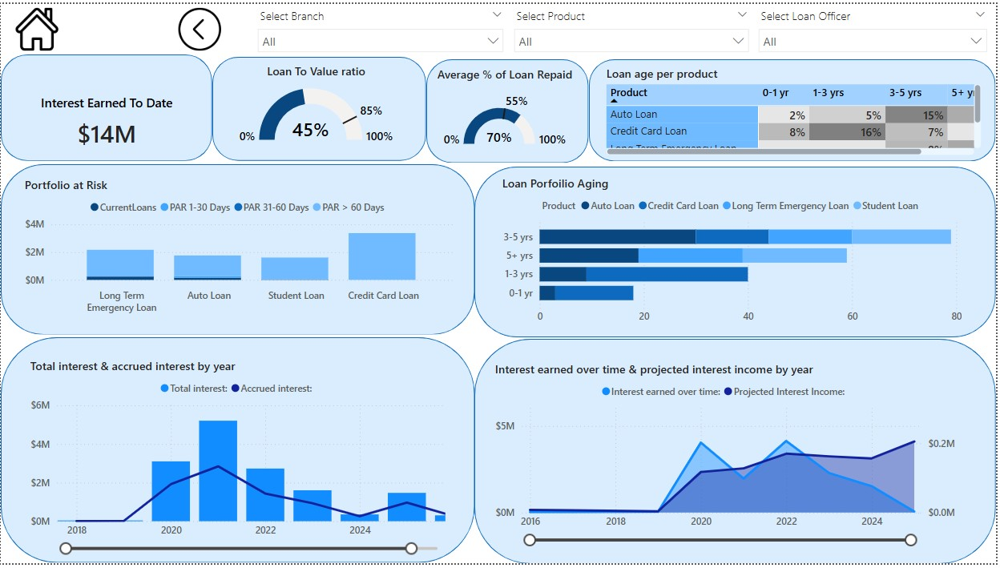

# 💼 ACME Commercial Bank - Power BI Dashboard Suite

*A fictional banking analytics project showcasing Power BI capabilities.*

---

## 📌 Overview

This Power BI dashboard suite provides interactive banking analytics for **ACME Commercial Bank** (a fictional institution). The project demonstrates data visualization, financial analysis, and business intelligence techniques using **synthetic data**.

  

---

## 📊 Dashboard Components

### 1. **Customer Segmentation Dashboard**

**Key Features:**
- Geographic customer distribution (branches/states)
- Customer growth trends (2012–2022)
- Active vs. inactive customer ratios
- Branch-level performance metrics

---

### 2. **Product Segmentation Dashboard**
 

**Key Features:**
- Product portfolio analysis (loans, deposits, accounts)
- Balance comparisons across product types
- Account status tracking (active/inactive)
- Branch-level product performance

---

### 3. **Savings Analysis Dashboard**
  

**Key Features:**
- Deposit trends and accrued interest
- Savings balance vs. yearly averages
- Product share of total deposits
- Interest accrual by branch (2020–2025)

---

### 4. **Loan Portfolio Analysis Dashboard**
   

   

**Key Features:**
- **Loan Disbursement by Stage:** Shows application, disbursement, recovery, and balance amounts

- **Loan Trend Over Time:** Tracks loan amounts by type per year

- **Delinquency Scatter Plot:** Shows overdue amounts by year and days past due

- **Loan Status Donut Chart:** Breaks down total loans by status (Active, Paid Off, etc.)

- **Portfolio-at-Risk (PAR)** tracking
- **Loan-to-Value (LTV)** ratio analysis
- **Loan aging** by product
- Interest earned & Interest income projections
- Average % of loans repaid
- Total interest & accrued interest by year

---

## 🛠️ Skills Showcased

### 📊 Data Visualization
- Geospatial Analysis leveraging map charts to visualize country wide distribution of customers
- Interactive dashboards with drill-down capabilities
- Dynamic filtering (branch, product, loan officer, time period)
- Custom KPIs, charts, and tooltips

### 💵 Financial Analytics
- Customer segmentation & behavior analysis
- Risk assessment (delinquency/PAR tracking)
- Interest accrual & forecasting models

### 🧠 Technical Implementation
- Power BI (DAX, data modeling)
- Oracle SQL scripting(raw data extraction & transformation)
- Time intelligence functions
- Data relationships, model performance & optimization

---

## ⚙️ Technical Details

| Component         | Description                      |
|------------------|----------------------------------|
| **Tool**          | Microsoft Power BI               |
| **Data Source**   | Oracle Database v19c      |
| **Key Visuals**   | Bar charts, Heatmaps, line graphs, KPIs, donut charts, scatter plots |
| **Filters**       | Branch, product, date range, loan officer,  status |

---

## 📖 Usage Instructions

1. **Open the `.pbix` file** in [**Power BI Desktop**](https://powerbi.microsoft.com/desktop/) to explore or edit the report.
2. Or, **view the published version online**:

   🔗 [**View Dashboard on Power BI Service**](https://app.powerbi.com/view?r=eyJrIjoiNTczZDdlOTgtMjZmNi00MDBiLTgzYWItOTJjNWVkODE2NDEyIiwidCI6IjRlYTFiNmIzLWUzZTItNGRmYi1hOGI3LWQ0MmRlNTlhNTVmZSIsImMiOjN9&pageName=5f04fb2ea6eb6d18b4a2)

2. Use the **tabs** to navigate between dashboards
3. Apply **slicers** to filter by branch, product, date range, and more
4. Hover over visuals for **detailed tooltips**
5. Click visuals to **cross-filter** other elements

---

## ⚠️ Disclaimer

> This is a **demonstration project** only.
>
> - ACME Commercial Bank is **fictional**
> - All data is **dummy data generated by me**
> - No real financial or customer information is used

---

## 🚀 Future Enhancements

- 🔗 Integrate with live banking APIs
- 🤖 Add machine learning for predictive analytics
- 📈 Expand with customer lifetime value modeling
- 🏦 Add transaction analysis value modeling

---

## 💡 Need More?

Want access to:
- 💬 DAX formulas
- 🛠 Step-by-step dashboard build guide
- 📁 Sample data files

**Feel free to reach out or open an issue in this repo!**

---
