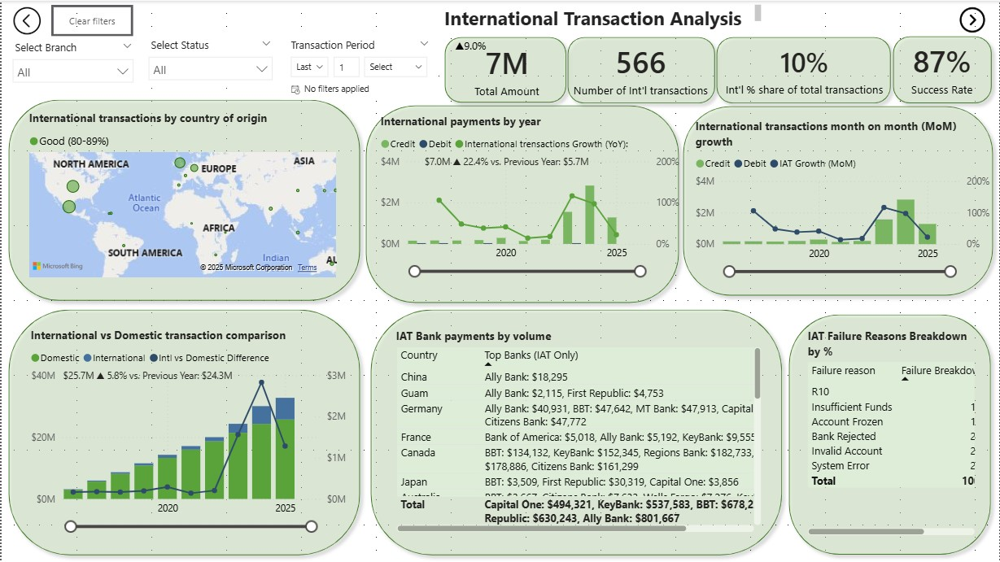

# 💼 ACME Commercial Bank - Power BI Dashboard Suite

*A fictional banking analytics project showcasing Power BI capabilities.*

---

## 📌 Overview

This Power BI dashboard suite provides interactive banking analytics for **ACME Commercial Bank** (a fictional institution). The project demonstrates data visualization, financial analysis, and business intelligence techniques using **synthetic data**.

  

---

## 📊 Dashboard Components

# Financial Transaction Analytics Dashboards

*Visualizing payment trends with advanced time intelligence*

## Time-Series Analytics Features

**Advanced Time Intelligence Implemented:**
- 🚀 **YoY Growth Tracking**: All dashboards show year-over-year comparisons with Δ% indicators
- 📈 **Quarterly Rollups**: QoQ analysis with seasonality adjustments
- 📅 **MoM Trend Analysis**: 12-month moving averages with anomaly detection
- ⏳ **Dynamic Period Selection**: Compare any time periods (MTD, QTD, YTD)
- 🔍 **Drill-Through Capability**: Click any metric to view daily granularity

**Smart Tooltip Features:**
- ▲▼ **Change Indicators**: Color-coded arrows show direction of change
- 💡 **Contextual Insights**: Hover to see comparative periods (e.g., "Up 12% vs Q2 2024")
- ⚠️ **Threshold Alerts**: Automatic highlights when metrics deviate >2σ from trend

## Dashboard Highlights

### 1. Transaction Volume & Trends Analytics

**Time Intelligence Features:**
- Dual-axis time series (2016-2025) with YoY growth callouts
- Failure rate trendlines with 30-day moving average
- Dynamic period selector (Daily/Weekly/Monthly views)

**Example Tooltip:**
> "Q3 2025: $4.2M ▲14% vs Q3 2024 | ▼8% from Q2 2025 peak"

### 2. Payment Type Analysis

**ACH Time Patterns:**
- IAT settlement time heatmap (by hour/day)
- Payment type seasonality matrix
- Bank processing speed trends (90-day rolling)

### 3. International ACH (IAT) Analysis

This dashboard is dedicated to international payments, this dashboard provides insights into cross-border transaction volumes, growth, and failure reasons.

**Key Time Metrics:**
* **Total Amount (International):** Overall financial value of international transactions.
* **Number of Int'l Transactions:** Count of international transactions.
* **Int'l % share of total transactions:** International transactions as a percentage of all transactions.
* **Success Rate (International):** Performance indicator for international transactions.
* **International transactions by country of origin:** A map visualization showing the volume of international transactions originating from different regions (North America, Europe, Asia, Africa, South America).
* **International payments by year:** Annual growth trend of international Credit and Debit payments.
* **International transactions month on month (MoM) growth:** Monthly growth trend for international Credit and Debit transactions.
* **International vs Domestic transaction comparison:** Compares the growth of international and domestic transaction volumes.
* **IAT Failure Reasons breakdown by %:** Specific failure reasons for International ACH Transactions (IAT).

### 4. Other Related Matrix / Transaction Failures Dashboard

This dashboard offers a deeper dive into the distribution of debit/credit transactions, quarterly growth, and the branch-wise distribution of transaction failures.

**Key Metrics & Visualizations:**

* **How are debit/credit transactions distributed?** A donut chart showing the percentage distribution of various debit and credit transaction types.
* **What is the quarterly growth trend?** Visualizes the quarterly growth of Credit and Debit transaction volumes from 2020 to 2025.
* **Which banks originate the most transactions?** A bar chart identifying the top banks by transaction origination volume.
* **What are our top failure reasons?** A treemap highlighting the most frequent transaction failure reasons (e.g., System Error, Bank Rejected, Insufficient Funds, OFAC, Currency Verification).
* **How are transaction failures distributed per branch?** A line chart showing the percentage of transaction failures across different branches (Downtown Branch, Venice Beach Branch, Long Island Branch, Uptown Branch).

### 📊 Data Visualization
- Geospatial Analysis leveraging map charts to visualize country wide distribution of transactions
- Interactive dashboards with drill-down capabilities
- Dynamic filtering (branch, bank name, transaction status, time period)
- Custom KPIs, charts, and tooltips

### 🧠 Technical Implementation
- Power BI (DAX, data modeling)
- Oracle SQL scripting(raw data extraction & transformation)
- Time intelligence functions
- Data relationships, model performance & optimization

---

## ⚙️ Technical Details

| Component         | Description                      |
|------------------|----------------------------------|
| **Tool**          | Microsoft Power BI               |
| **Data Source**   | Oracle Database v19c      |
| **Key Visuals**   | Bar charts, Box & Whisker plots, line graphs, KPIs, donut charts, Pareto distribution graph |
| **Filters**       | Branch, product, date range, loan officer,  status |

---

## 📖 Usage Instructions

1. **Open the `.pbix` file** in [**Power BI Desktop**](https://powerbi.microsoft.com/desktop/) to explore or edit the report.
2. Or, **view the published version online**:

   🔗 [**View Dashboard on Power BI Service**](https://app.powerbi.com/view?r=eyJrIjoiNTczZDdlOTgtMjZmNi00MDBiLTgzYWItOTJjNWVkODE2NDEyIiwidCI6IjRlYTFiNmIzLWUzZTItNGRmYi1hOGI3LWQ0MmRlNTlhNTVmZSIsImMiOjN9&pageName=5f04fb2ea6eb6d18b4a2)

2. Use the **tabs** to navigate between dashboards
3. Apply **slicers** to filter by branch, product, date range, and more
4. Hover over visuals for **detailed tooltips**
5. Click visuals to **cross-filter** other elements

---

## ⚠️ Disclaimer

> This is a **demonstration project** only.
>
> - ACME Commercial Bank is **fictional**
> - All data is **dummy data generated by me**
> - No real financial or customer information is used

---

## 🚀 Future Enhancements

- 🔗 Integrate with live banking APIs
- 🤖 Add machine learning for predictive analytics
- 📈 Expand with customer lifetime value modeling
- 🏦 Add transaction analysis value modeling

---

## 💡 Need More?

Want access to:
- 💬 DAX formulas
- 🛠 Step-by-step dashboard build guide
- 📁 Sample data files

**Feel free to reach out or open an issue in this repo!**

---
